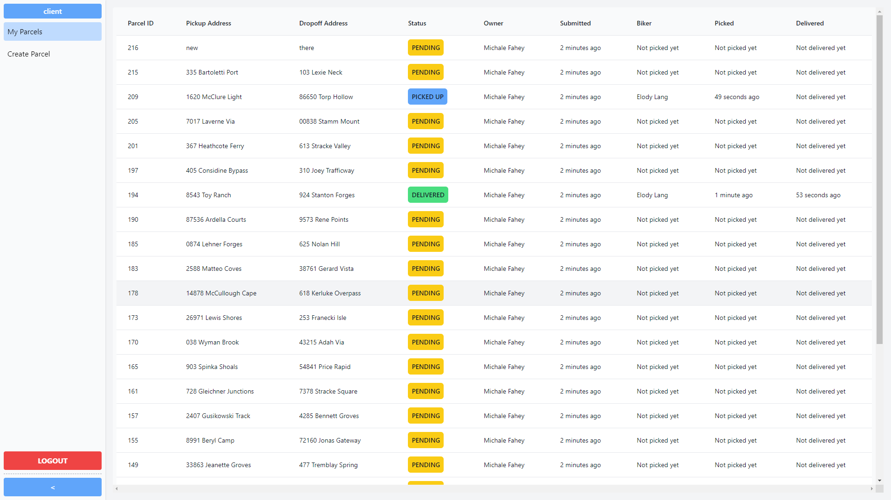
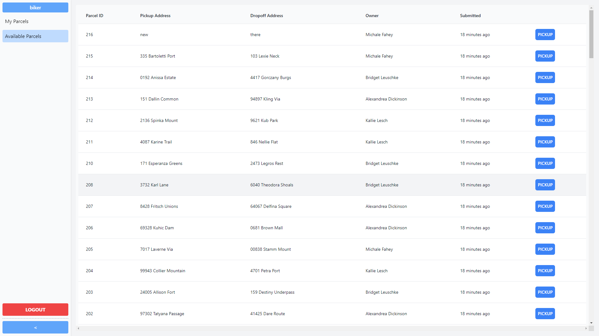
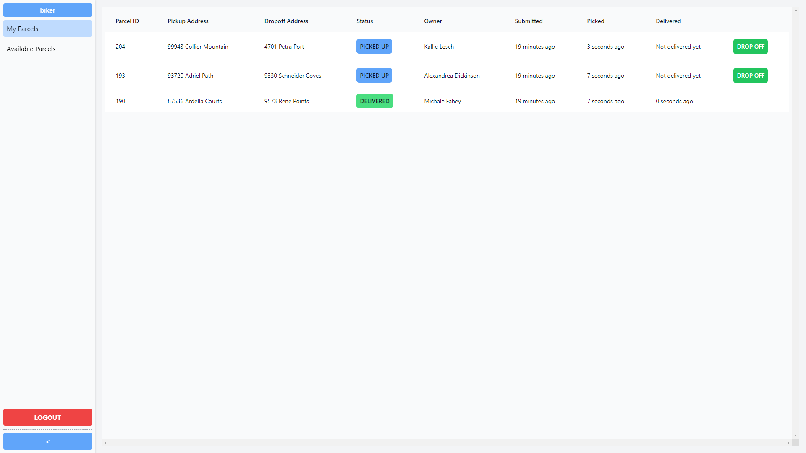

# Parcel Delivery

## Description

This is a simple application that allows you to create a parcel delivery order. It also allows you to view all the orders that have been created. Created as part of Saloodo's coding challenge.

## Installation

- Clone the repository
- Run `docker-compose up` to start the application

This will spin up the containers for the server, client, and the Postgres database.

By default the server will be running on port 4000 and the client on port 3000. The server will populate the database with some sample data if it detects that the `NODE_ENV` variable is equal to `development`.

## Usage

Access the client at `http://localhost:3000`.

By default, there'll be 5 different clients, and 5 different bikers.
Each client will have 25 parcels, all pending.

To login as a client, use the following credentials:

- email: `client.1@test.com`
- password: `123`

> Note: The password is the same for all clients.
> The email for each clients follows the pattern `client.${i}@test.com` where i is between 0 and 4.

To login as a biker, use the following credentials:

- email: `biker.2@test.com`
- password: `123`

> Note: The password is the same for all bikers.
> The email for each bikers follows the pattern `biker.${i}@test.com` where i is also between 0 and 4.

Only bikers can pickup and deliver parcels, and only clients could create parcels.

You may always create new clients by going to the `/signup` route.

## Screenshots

### Client view

### Biker available view

### Biker picked view

This view is populated after the biker has picked up parcels from `/biker` route.

